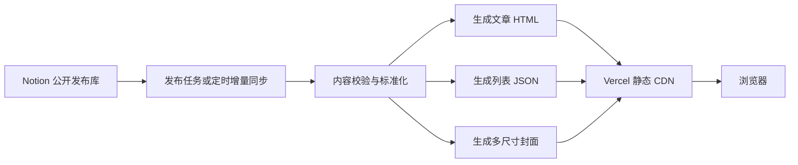

# 项目性能审计与优化建议

> 审计日期：2026-07-10 至 2026-07-11
> 测试对象：生产环境 v8.5
> 基线提交：`71b408aa48607f1ca88c3ae3f36a810bfc065b01`
> 说明：Notion 数据库是专门用于公开发布的内容库，公开性属于既定设计，不作为本报告的问题项。
> v8.6 修复复检：2026-07-17。第 4～8 节的耗时和“当前实现”描述保留为 v8.5 生产基线；下方“v8.6 落地结果”记录本轮代码修复，部署后的生产指标需重新冷测，不能用本地结果冒充。

## 1. 这份报告要帮助决定什么

本报告用于决定两件事：

1. 如何以较小风险快速修复当前明显的冷加载问题。
2. 是否将当前“访问时读取 Notion 并动态生成内容”的架构，逐步升级为“发布时生成、访问时只读静态 CDN”的内容发布架构。

最关键的前提是内容时效。本报告按以下假设提出方案：

- 公开文章允许在发布后 1～5 分钟内完成更新。
- 发布流程可以主动刷新或失效缓存。
- 优先保证中国及亚洲网络环境中的首次访问体验。

如果文章必须秒级更新，需要缩短缓存时间或保留更多动态路径，性能上限会相应降低。

### 1.1 v8.6 落地结果

| 基线问题 | v8.6 修复结果 | 防回归约束 |
|---|---|---|
| Google Fonts 将首页 LCP 拖到 7.42s | 删除外部字体、预连接和字体加载器，统一改用系统字体栈，并从 CSP 移除字体域名 | Smoke 要求三个页面和共享 CSP 的外部字体域名均为 0 |
| 博客数据在串行模块链之后才请求 | 新增独立 `blog-bootstrap.js`，在页面入口最早阶段启动列表请求；博客只加载 Shared/Utils/URL、`notion-api.js`、`bookmark.js` 和 `blog-page.js`，不再下载 `notion-article-renderer.js` 与完整 `notion-content.js`；文章路由仍保留完整渲染链 | 页面级 modulepreload 清单、bootstrap 精确 URL 一次性消费、35s 总预算与取消行为测试；博客关键路径减少 2 个请求和 53,946 bytes 源文件体积 |
| 首屏三张动态封面同时争抢 | 只将首个有效封面设为 preload/eager/high，其余均为 lazy/auto；封面 URL 显式固定 `format=webp`，不再按 `Accept` 碎片化 CDN 键 | 真实列表 fixture 断言恰好 1 张高优先级封面和其余低优先级封面 |
| 文章 HTML/JSON `no-store` | 公开成功响应使用 `s-maxage=300, stale-while-revalidate=600`；错误、非法 ID 与 404 仍为 `no-store` | API 契约分别覆盖成功与失败缓存语义；陈旧窗口刻意低于 Notion 临时文件 URL 的常见有效期 |
| SPA 固定 2.5s 后强制二次导航 | 删除固定 watchdog，拆分 15s 网络与 10s 页面准备 deadline；网络失败保留旧页并显示重试，跨部署/结构/准备失败只执行一次真实导航以获取原子资源版本 | 行为测试覆盖旧 DOM/URL/SEO 事务回滚、可访问反馈、单次 hard navigation、当前页/外域不预取 |
| 请求离开页面后仍继续工作 | 列表和详情页传递 `AbortSignal`；服务端 Notion 操作使用总 deadline；图片客户端断开会销毁上游流与 Sharp 工作 | 共享请求最后一个消费者取消才终止底层；客户端取消、内部超时和上游错误分开测试 |
| 客户端 15s 预算短于服务端 30s 完整操作 | 列表、详情与早期 bootstrap 统一为 35s；服务端配置与显式 override 均钳制到最大 30s | Smoke 解析并比较两端常量，要求浏览器预算至少多 5s，并覆盖 `40000ms` 配置钳制 |
| 手工版本号可能复用旧静态 URL | 静态资源版本加入最终 JS/CSS/assets/manifest 字节的 12 位确定性指纹，并使用一年 `immutable` 缓存 | `check` 重新计算指纹；任何资源字节变化但未重签都会失败 |
| 同义图片 URL 可碎片化 CDN 键 | 图片固定 `src→sig`；封面固定 `format→src→sig→w`，格式和宽度都必填，不读取 `Accept`、不发送 `Vary: Accept`；拒绝重排与等价百分号编码 | Raw URL smoke 断言在 DNS、源站与 Sharp 前返回 400，并锁定显式格式响应头 |
| 文章 ID 的大小写/连字符/查询别名可拆分缓存 | 服务端路由、客户端 pending/session 缓存、书签和数据 URL 全部收敛为小写无连字符 32 位 ID；合法 HTML 变体 308 到 canonical route，数据接口非规范别名 fail-closed | URL、缓存键、共享请求和 raw query 合约使用真实 Notion ID 覆盖大小写/连字符/重复参数 |
| 书签中的临时封面签名会随密钥轮换失效 | 封面签名独立按 30 分钟刷新；当前摘要即时覆盖；失败/部分刷新按 5–60 秒有界指数退避，恢复在线立即重试，跨标签页元数据变化会同步且旧响应不能覆盖新刷新 | 书签 freshness、offline fallback、online retry、bounded backoff、并发/跨标签页合并测试 |
| 固定粒子策略无法覆盖窄屏桌面、低配设备和省流量模式 | `<=768px`、`saveData`、reduced-motion 关闭 canvas；宽屏按能力和实测帧成本在 350 / 220 / 120 三档自适应，低配档为 30fps | 独立 particle-runtime 行为测试覆盖宽度、能力、降档、恢复和关闭原因 |
| 取消后的旧请求可能晚到并污染缓存 | single-flight 仅在最后一个消费者离开时取消；已放弃 loader 的晚到成功/失败不能改写新缓存或 cooldown；同一分类的不同搜索复用分类基础页，未知分类不请求 Notion | late-success/late-failure、元数据 late-write、分类搜索复用和未知分类测试 |
| Sitemap 与本地只读 API 缺少完整生命周期边界 | Sitemap 复用 operation/disconnect lifecycle 并在 finally 清理；本地服务器转发 raw URL/断开状态，非 GET/HEAD 请求体仅流式 drain、不聚合到内存 | sitemap cancellation/error cache 与真实本地 HTTP body/method/lifecycle 合约 |
| 性能修复缺少体验与结构门禁 | 增加完整博客/文章视觉 fixture、真实本地 HTTP 集成、PWA 图标尺寸、dotenv、生成器边界和关键路径契约；视觉捕获先验证动态效果，再固定测试随机源/无限 CSS 动画相位，三样本不收敛时拒绝更新 baseline | 快速门禁保持只读，生成内容通过 `assets:sync` 显式同步；严格像素门禁继续使用 0.5% 阈值，基线样本收敛阈值为 0.25% |

文章正文图片只在 Notion 上游同时提供真实宽高时写入固有尺寸；未知尺寸不会再伪装成 `1600×900`，避免制造错误的 16:9 留白。要让所有正文图片都具备确定的占位并进一步压低 CLS，仍需在发布阶段探测并持久化真实图片元数据，或迁移到可记录尺寸的静态媒体流水线；这属于第 9 节的架构演进，不应靠猜测尺寸完成。

发布时生成静态封面和文章仍是第 9 节所述的架构演进，不是本轮对现有动态发布路径的原地缺陷修补。v8.6 已将当前架构的缓存、取消、完整性和关键加载时序闭合；是否迁移到静态发布应由内容时效、发布钩子和回滚能力共同决定。

当前页面形态也应区分清楚：首页与博客是静态 HTML shell 加客户端数据，只有 canonical `/posts/:id` 文章路由执行 SSR。这里所说的“文章边缘缓存”和“静态发布演进”都不意味着首页或列表已改为服务端渲染。

## 2. 执行摘要

当前“加载很慢”不是单一问题，而是三条不同的冷加载链路：

1. 首页被 Google Fonts 的首次网络请求拖慢。
2. 博客列表被串行 JavaScript、文章列表 API 和动态封面转换依次拖慢。
3. 文章详情被实时 SSR、Notion 上游访问和 `no-store` 缓存策略拖慢。

关键判断：

- 热缓存后的博客 LCP 约为 `0.39s`，说明页面渲染算法和总体资源体积不是主要矛盾。
- 桌面端基本没有长任务，当前问题主要是网络依赖、请求时序和冷启动。
- JavaScript 总传输量约 `63KB`，无需为了性能改用大型前端框架。
- CLS 很低，页面布局稳定，现有视觉结构不需要大规模重构。
- 优化重点应从“继续压缩少量代码”转向“消除外部字体、请求瀑布和访问时计算”。

## 3. 测试方法与范围

本次使用真实 Chromium 浏览器对生产环境进行只读测试，覆盖：

- 首页桌面冷加载。
- 博客列表桌面冷加载与热加载。
- 博客列表 Slow 4G、4 倍 CPU 模拟。
- 文章详情桌面冷加载。
- 首页阻断外部字体的因果对照。

测试重点包括：

- TTFB：首字节时间。
- FCP：首次内容绘制。
- LCP：最大内容绘制。
- CLS：累积布局偏移。
- Long Tasks：主线程长任务。
- Resource Timing：资源请求起止时间、大小和依赖顺序。
- CDN 与浏览器缓存命中情况。

这些结果是一次受控诊断基线，不等同于长期真实用户 p75 数据。后续仍应增加真实用户监控。

## 4. 实测结果

| 场景 | TTFB | FCP | LCP | 主要现象 |
|---|---:|---:|---:|---|
| 首页桌面冷加载 | 0.52s | 1.62s | 7.42s | 两个字体文件分别耗时约 5.8s |
| 博客列表桌面冷加载 | 0.32s | 0.76s | 6.35s | 列表 API 直到 2.54s 才开始，封面约 6.3～6.7s 完成 |
| 博客列表桌面热加载 | 0.33s | 0.38s | 0.39s | 浏览器和 CDN 命中后非常快 |
| 博客列表 Slow 4G、4 倍 CPU | 0.40s | 1.21s | 3.67s | 即使 API/CDN 已较热，串行模块链仍推迟内容请求 |
| 文章详情桌面冷加载 | 0.31s | 2.93s | 3.21s | HTML 完整返回耗时 2.37s，响应为 `no-store` |

### 4.1 稳定性指标

- 首页 CLS 约 `0.010`。
- 博客 CLS 约 `0.008`。
- 移动模拟 CLS 约 `0.00025`。
- 首页和博客桌面冷加载未发现明显主线程长任务。
- 移动模拟发现 5 个约 `74～151ms` 的长任务，主要发生在多模块解析、执行和列表渲染阶段。

现有布局稳定性良好。优化时应避免因字体、图片尺寸或骨架屏改造导致 CLS 回退。

## 5. 首页：外部字体是首要瓶颈

首页目前会连接 Google Fonts 相关域名，并同时对 `.com` 和 `.cn` 域名进行预连接。实际字体仍从 `.com` 域名加载：

- Inter WOFF2：约 `48KB`，请求耗时约 `5.83s`。
- Google Sans WOFF2：约 `34KB`，请求耗时约 `5.82s`。

相关实现：

- [`index.html`](./index.html#L22)
- [`blog.html`](./blog.html#L22)
- v8.5 基线中的 `js/font-loader.js`（已在 v8.6 删除）

字体样式最初使用 `media="print"` 延迟加载，随后由字体加载器切换成 `media="all"`。这让备用字体可以先显示，但正式字体迟到后会重新绘制文本，并将最终 LCP 推迟到字体完成时。

### 5.1 因果对照

将 Google Fonts 请求替换为空字体样式后：

- 页面 `load` 从约 `7.42s` 降到约 `0.55s`。
- FCP 从 `1.62s` 降到约 `0.57s`。

对照会话没有返回可用的 LCP 候选，因此不在报告中推测对照 LCP；但原始测试中字体完成时间与 7.42 秒 LCP 同时发生，且没有主线程长任务，因果证据已经充分。

### 5.2 修复建议

最高质量方案：

1. 中文正文和主要 UI 使用系统字体栈。
2. 移除 Google Sans 外部依赖。
3. 如确实需要 Inter，只自托管经过授权、精简后的 WOFF2。
4. 只保留真实使用的字重和字符范围。
5. 使用 `font-display: optional`，避免慢网络下发生迟到的字体替换。
6. 只预加载首屏实际需要的一个字体文件。
7. 删除未实际使用的 `.cn`/`.com` 双重预连接。

不建议简单改用另一个公共字体代理，因为外部网络依赖和可用性风险仍然存在。也不建议在授权不明确时自行分发 Google Sans。

预期目标：主页桌面冷加载 LCP 进入 `1～1.5s`。

## 6. 博客列表：请求瀑布是核心问题

当前关键路径如下：


### 6.1 JavaScript 模块串行下载

[`js/app.js`](./js/app.js#L14) 使用连续的 `await import()` 加载：

1. `notion-content-utils.js`
2. `notion-content-url.js`
3. `notion-article-renderer.js`
4. `notion-content.js`
5. `notion-api.js` 与 `bookmark.js`
6. 最后才加载 `blog-page.js`

实测时间线：

- 共享模块约在 `0.64s` 开始加载。
- `blog-page.js` 约在 `2.14～2.54s` 加载。
- `/api/posts-data` 直到 `2.54s` 才开始请求。

部分模块存在执行依赖，但网络下载不必因此串行。当前约有 16 个脚本请求，总传输量约 `63KB`；文件不大，但慢网络中的多次 RTT 会形成明显瀑布。

### 6.2 列表 API 响应很小，但冷请求慢

`/api/posts-data` 的压缩响应约 `1KB`，但冷请求耗时约 `1.42s`：

- 请求开始：约 `2.54s`。
- 请求结束：约 `3.96s`。
- CDN 状态：`x-vercel-cache: MISS`。

这说明瓶颈不是传输带宽，而是请求启动过晚，以及 Serverless、上游 Notion 或边缘缓存的冷路径。

### 6.3 动态封面转换推迟 LCP

列表数据返回后，浏览器才获得封面 URL。三张首屏封面约在 `3.98s` 开始请求，分别耗时：

- `2.75s`
- `2.50s`
- `2.35s`

三张图片总量不到 `100KB`，但每张都需要经过 `/api/cover` 获取源图并进行运行时转码。

当前转换策略位于 [`api/cover.js`](./api/cover.js#L38)：

- 优先 AVIF。
- AVIF `effort: 4`。
- WebP `effort: 4`。
- 生成结果使用长期 CDN 缓存。

缓存策略本身较合理，但首次遇到新的源图、尺寸和格式组合时，仍然必须现场生成。

### 6.4 热加载为什么很快

同一页面热加载时：

- FCP 约 `0.38s`。
- LCP 约 `0.39s`。
- 总传输量约 `5KB`。
- 封面直接使用浏览器缓存。

这证明主要问题是冷路径，而不是页面持续运行效率。

## 7. 博客列表修复方案

### P0：让文章数据立即开始请求

页面识别为博客页后，应立即启动文章列表请求，同时加载渲染模块：

```js
const postsPromise = fetchPostsData();
const modulesPromise = loadBlogModules();

const [posts] = await Promise.all([
  postsPromise,
  modulesPromise,
]);
```

正式实现应将 Promise 放入明确的页面启动上下文，确保：

- 不会重复请求。
- 路由切换时能够取消或忽略过期结果。
- 请求失败可以独立重试。
- 页面模块与数据拥有清晰的加载状态。

目标：将 `/api/posts-data` 请求起点从约 `2.54s` 提前到 `0.3～0.6s`。

### P0：并行下载模块，保留必要执行顺序

短期方案：

- 在页面 HTML 中为页面专属模块增加 `modulepreload`。
- 让浏览器并行下载依赖。
- JavaScript 仍按依赖顺序执行，降低行为变化风险。

长期方案：

- 将全局工厂模块逐步改为明确的 ESM 依赖。
- 建立 `blog-entry.js` 和 `post-entry.js` 页面入口。
- 使用轻量构建工具生成带内容哈希的入口包。
- 保留清晰的领域模块边界，不引入不必要的大型框架。

### P0：发布时生成封面

最佳方案是在文章发布时：

1. 下载 Notion 封面原图。
2. 生成 320、640、960 等必要尺寸。
3. 输出 WebP；是否同时保留 AVIF由受控基准测试决定。
4. 使用内容哈希文件名。
5. 上传到静态 CDN。
6. 在文章列表数据中直接返回最终静态地址和固有宽高。

如果暂时保留动态封面接口：

- 发布后主动预热常用尺寸。
- 只给真正的 LCP 封面设置 `fetchpriority="high"`。
- 其余封面使用懒加载，避免三个高优先级转换同时争抢资源。
- 对 WebP、AVIF 和不同 `effort` 做同源、同尺寸、同冷启动条件的基准测试。
- 保留现有长期 CDN 缓存和 `stale-while-revalidate`。

目标：缓存命中封面响应 `<200ms`，发布后的真实用户不再遇到运行时转换 MISS。

### P1：核实现有文章列表边缘缓存

复检确认：v8.5 的 `/api/posts-data` 已经返回下列缓存头，因此“需要新增列表边缘缓存”不是有效问题项：

```http
Cache-Control: public, max-age=0, s-maxage=60, stale-while-revalidate=300
```

v8.6 保留该策略，并进一步收紧规范化查询参数，避免语义相同的 `page=1`、空搜索或非规范参数产生不同缓存键。仍需遵守：

- 发布时主动刷新或失效列表缓存。
- 生成稳定 ETag。
- 错误响应和不完整响应不使用长期缓存。
- 客户端保留最近一次成功数据，短暂上游故障时降级显示。

如果发布流程能可靠失效缓存，可以适当延长 `s-maxage`；在此之前不应仅为了命中率扩大陈旧窗口。

## 8. 文章详情：SSR 与 no-store 阻止复用

文章详情实测：

- TTFB：约 `0.31s`。
- HTML 完整返回：约 `2.37s`。
- FCP：约 `2.93s`。
- LCP：约 `3.21s`。
- CDN 状态：`x-vercel-cache: MISS`。
- 缓存策略：`Cache-Control: no-store`。

基线相关实现位于 [`api/post.js`](./api/post.js)。v8.6 已将正常公开文章改为短期边缘缓存，错误页继续 `no-store`。

首字节不算特别慢，但完整响应仍需等待约两秒，说明主要耗时发生在服务端内容获取、标准化或渲染阶段。使用 `no-store` 后，边缘节点无法复用已经生成的文章 HTML。

客户端文章模块也存在动态加载链，但本次文章 LCP 的首要瓶颈仍然是 HTML 返回过晚。

### 8.1 短期修复

对已公开发布的正常文章建议：

```http
Cache-Control: public, max-age=0, s-maxage=300, stale-while-revalidate=86400
```

并满足以下约束：

- 发布、更新或撤回文章时主动失效对应缓存。
- 404、鉴权失败、上游错误和异常页面不使用相同长期缓存。
- 草稿和未发布内容不进入公共缓存。
- 必要时保留 ETag 或内容版本号。

### 8.2 长期修复

文章发布时直接生成静态 HTML，由 CDN 返回；访问请求不再调用 Notion或运行 SSR。

## 9. 推荐的最终架构

Notion 数据库本来就是专门的公开发布库，因此更适合让 Notion 作为 CMS，让网站作为静态发布结果。



高质量发布流程应具备：

- 只重新处理发生变化的文章。
- 内容校验失败时不覆盖当前线上版本。
- 生成结果使用内容哈希或版本号。
- 所有产物完成后原子切换。
- 保留上一版本，支持快速回滚。
- 发布后预热首页、博客页、文章页和首屏封面。
- 定时任务作为发布钩子失败时的补偿机制。
- 记录发布版本、文章版本和构建结果，便于审计与排错。

该架构能够消除：

- 访客请求期间访问 Notion。
- Serverless 冷启动。
- `no-store` SSR。
- 运行时图片转换。
- API 与前端模块之间的长瀑布。
- Notion 短暂故障直接影响网站可用性。

## 10. 静态资源和路由的次级优化

### P1：使用内容哈希文件名

v8.5 静态资源主要通过手工查询参数版本号更新。v8.6 保留无需构建的查询参数形式，但参数已包含对最终静态内容计算的确定性指纹，并设置：

```http
Cache-Control: public, max-age=31536000, immutable
```

HTML 保持短缓存或重新验证；带指纹查询参数的 JS、CSS 和 assets 可以安全长期缓存。若未来引入正式构建产物，再迁移为内容哈希文件名即可，不需要为本轮修复引入大型前端框架。

### P2：限制非必要预取

路由预取应根据网络条件降级：

- `navigator.connection.saveData === true` 时禁用。
- 慢速网络下减少主动预取。
- 只预取最可能的下一跳。
- 预取不得与首屏封面、字体或核心 API 争抢优先级。

### P2：减少关键路径请求数量

当前脚本总体积不大，因此重点不是极限压缩，而是减少首屏关键请求数量和往返次数。目标是将页面关键脚本收敛为少量入口包，同时保持可测试的模块边界。

## 11. 不建议采用的方案

- 不建议为了性能重写成 React、Vue 或其他大型框架，当前瓶颈不在框架。
- 不建议只继续压缩 JavaScript，当前约 `63KB`，不是主因。
- 不建议只降低 AVIF 质量，文件已经不大，主要问题是实时编码和冷路径。
- 不建议继续增加字体预连接，问题是外部字体依赖本身。
- 不建议让浏览器直接调用 Notion，这会增加耦合并暴露实现细节，也无法解决缓存和网络问题。
- 不建议给所有响应无限期缓存而不建设发布失效机制。
- 不建议同时高优先级加载多张非 LCP 封面。

## 12. 建议实施顺序

### 第一阶段：性能止血

1. 移除 Google Fonts 外部请求。
2. 让文章列表请求提前，并与模块加载并行。
3. 增加页面模块预加载或构建页面入口包。
4. 为列表 API 和公开文章 HTML 增加短期边缘缓存。
5. 发布后预热首屏封面。

该阶段投入较小，预计能够解决大部分当前可感知的慢加载。

### 第二阶段：消除动态封面

1. 建立封面生成脚本。
2. 生成多尺寸静态资源。
3. 改造列表数据中的封面地址。
4. 保留旧接口作为短期兼容回退。
5. 验证内容哈希、缓存和撤回流程。

### 第三阶段：静态发布架构

1. 增量拉取 Notion 内容。
2. 生成列表 JSON 和文章 HTML。
3. 原子部署。
4. 建立缓存失效、预热和回滚。
5. 移除访客请求路径中的 Notion依赖。

## 13. 预期收益与代价

以下收益存在重叠，不能直接相加：

| 修改 | 主要收益 | 主要代价或风险 |
|---|---|---|
| 移除外部字体 | 首页冷加载预计改善约 5～6s | 字体外观会略有变化，需要视觉复核 |
| 数据与模块并行 | 博客内容可提前约 1.5～2s 开始渲染 | 需要处理取消、重复请求和错误状态 |
| 静态封面 | 消除约 2～3s 的冷转换路径 | 增加发布脚本和静态存储流程 |
| 文章边缘缓存 | 冷文章响应预计改善约 1.5～2s | 内容可能短暂陈旧，需要主动失效 |
| 静态文章发布 | 最佳性能、可靠性和可预测性 | 需要完整发布、回滚和增量构建机制 |
| 哈希静态资源 | 回访和跨页面缓存更稳定 | 需要构建清单和引用更新机制 |

## 14. 性能验收标准

建议将以下指标纳入自动化验证：

| 指标 | 目标 |
|---|---:|
| 首页桌面冷加载 LCP | `<1.5s` |
| 博客桌面冷加载 LCP | `<2.0～2.5s` |
| Slow 4G 博客 LCP | `<3.0s` |
| 文章详情 LCP | `<2.5s` |
| 边缘命中文章 HTML | `<300ms` |
| 边缘命中封面 | `<200ms` |
| `/api/posts-data` 请求起点 | `<600ms` |
| CLS | `<0.05` |
| 外部 Google Fonts 请求 | `0` |
| 桌面端超过 50ms 的长任务 | 尽量为 `0` |

自动化测试应同时覆盖：

- 全新浏览器冷缓存。
- 浏览器热缓存。
- CDN MISS。
- CDN HIT。
- 桌面网络。
- Slow 4G 和 4 倍 CPU。
- 亚洲实际访问节点。
- 发布、更新、撤回和缓存失效流程。

## 15. 持续监控建议

除实验室测试外，还应采集真实用户数据：

- LCP、INP、CLS 的 p50、p75 和 p95。
- 首次访问与回访用户分开统计。
- 国家/地区、网络类型和设备等级分组。
- `/api/posts-data`、文章 SSR、封面接口的 CDN HIT/MISS。
- Serverless 冷启动与 Notion 上游耗时。
- 发布完成到边缘节点可见的实际延迟。

每次发布至少执行一次冷缓存性能回归，避免只验证本地或热缓存结果。

## 16. 最终建议

最高优先级不是继续做细碎压缩，而是消除三类结构性延迟：

1. 外部字体。
2. 串行请求瀑布。
3. 访问时动态计算。

短期先完成字体、并行数据请求、模块预加载、短期边缘缓存和封面预热；随后将封面和文章逐步迁移到发布时静态生成。

对于这个专门使用公开 Notion 数据库发文的项目，“Notion 作为 CMS、静态 CDN 作为用户访问面”是性能、可靠性和长期代码质量最优的架构终点。
